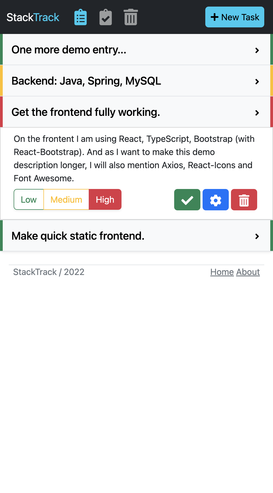
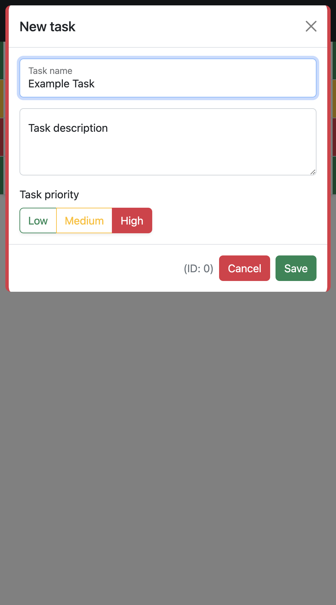
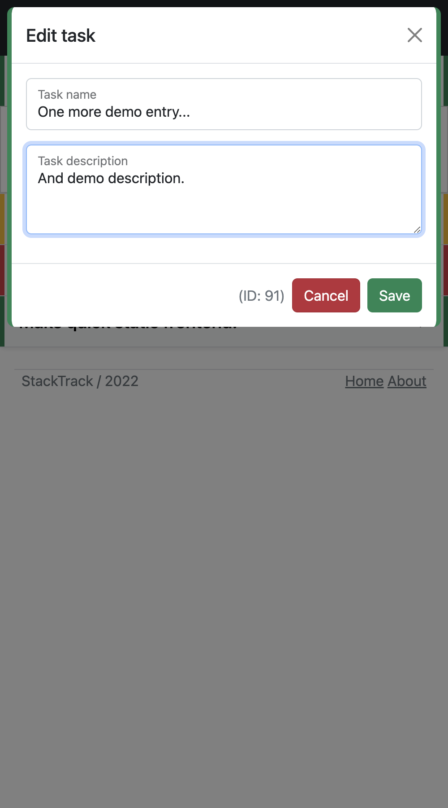
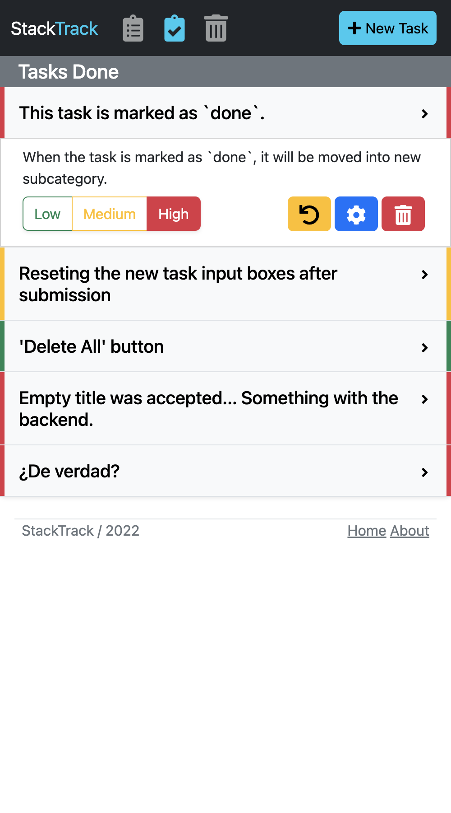
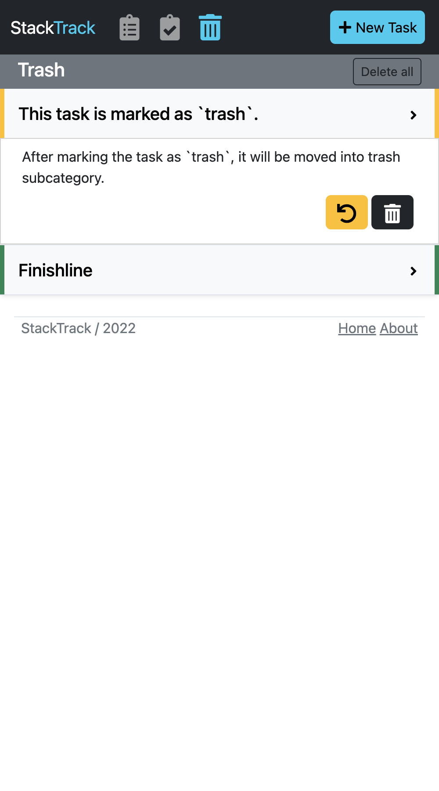
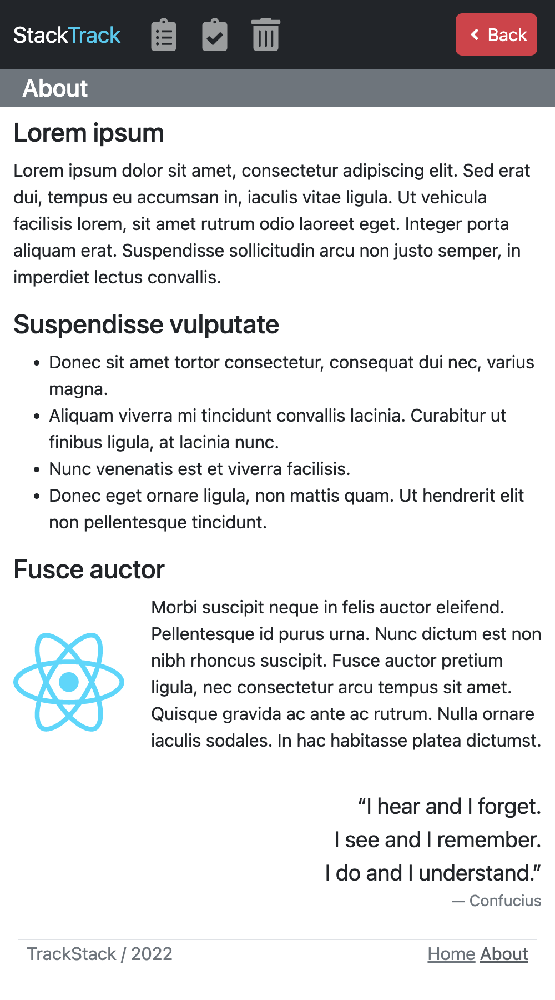

# StackTrack
*A simple task tracking application.* 
- User can add, edit and delete tasks. 
- For the task user can choose a title, description and priority level. 
- Tasks can be moved between main-list, done-list and trash-list by clicking buttons below the task accordingliy.
- By default only title of the task is visible. Clicking on the task will display the description, priority switcher and manage-buttons.
- Priority is updated immediately after the switch - no confirmation needed.

### Stack
- Front: TypeScript, React, Bootstrap
- Back: Java, Spring, MySQL

### Main View - List of tasks
<kbd>

</kbd>

### Create Task & Update Task

  <kbd></kbd>
  <kbd></kbd>

### Tasks done and Trash

  <kbd></kbd>
  <kbd></kbd>

### About page
<kbd></kbd>

